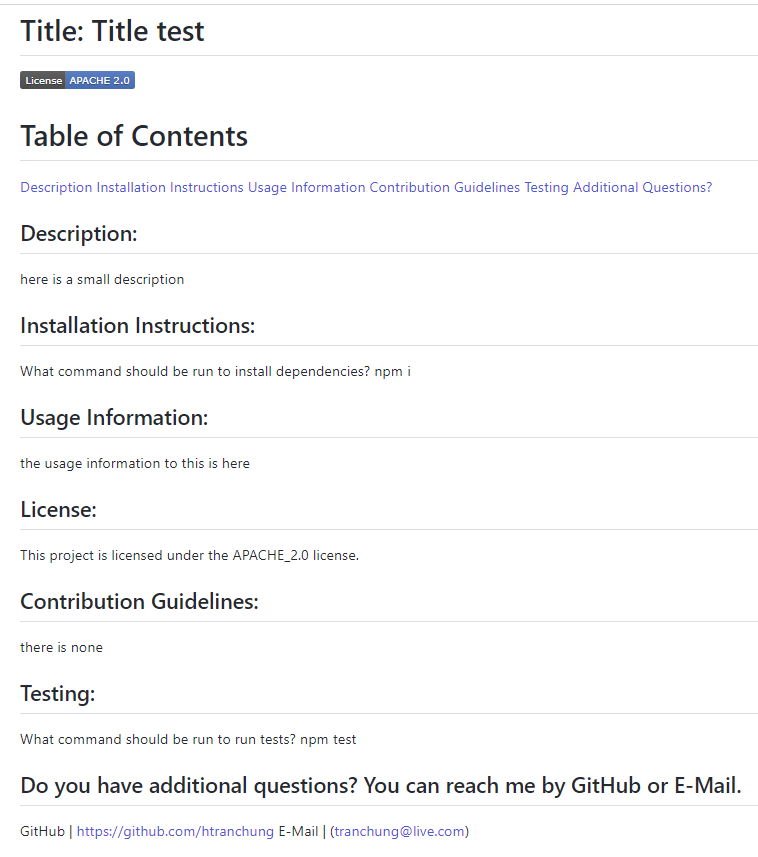

# 09 Node.js README Generator

 

## Description

- Generates a professional README File using Node.js
- Creates Title, Table of Contents, Description, Installation, Usage, License, Contribution, Testing, Contact Me
- If user has additional questions my GitHub and Email is listed in README

## Usage

User uses Node.js to create a professional README file. Questions are asked for the README file and then user inputs answers in. After all questions have been answered, a README file is generated at the end. 

## Credits
N/A
